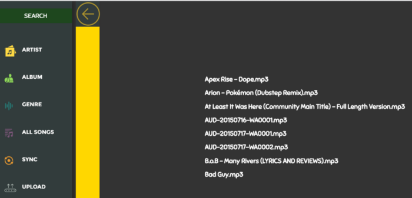
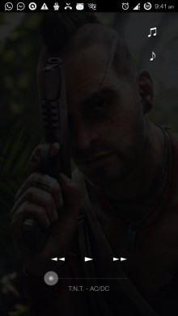

# soundvibe
A music player with the potential to share files locally or remotely(WebRTC) 

# Missing :
  - Event handlers for all the buttons
  - Function calls for setting up LAN/WebRTC connections
  - Handler for Search bar 
  
  Basically everything, but there is some stuff that can be referenced...

